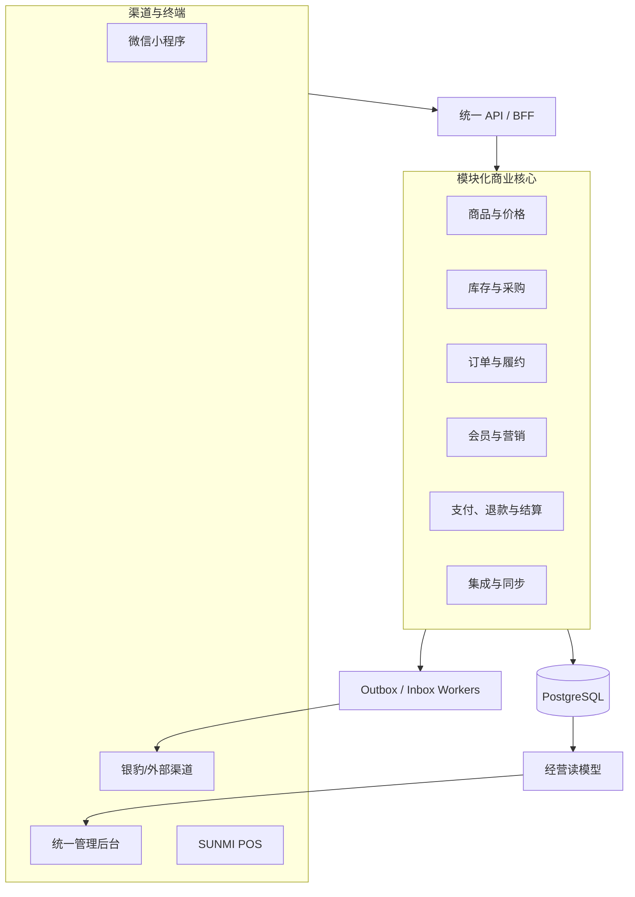

# 统一商业后台与可演进服务架构设计

- 任务：[#84](https://github.com/lpearf-pixel/community-selection-miniapp/issues/84)
- 基线：`stable/l49-business-base`
- 设计分支：`codex/l50-unified-commerce-admin-design`
- 状态：设计评审稿；本分支不修改生产代码、依赖、数据库或迁移
- 日期：2026-07-21

## 1. 结论

本项目采用“统一商业核心 + 模块化单体 + 渠道适配器 + 事务 outbox/inbox”的架构。

微信小程序、后台管理、SUNMI 自研收银端和银豹等外部 POS 都是渠道或终端。商品、价格、库存、订单、会员、支付、退款和售后必须进入同一套规范模型、同一套账本与同一后台。任何渠道不得私自成为第二套不可对账的业务核心。

当前不拆微服务，不引入 Kafka，也不替换现有 React、Ant Design、Fastify、Prisma 和 PostgreSQL。先在代码、数据所有权、事件契约和运维边界上形成可拆分的领域模块；当性能、故障隔离或团队交付证据达到阈值时，再按领域逐个拆出服务。

这一决策同时满足三项目标：

1. 单店和早期业务保持低成本；
2. 线上线下数据可以可靠统一；
3. 流量增长后可以横向扩容、拆分服务并进行容灾，而不推倒渠道协议和后台信息架构。

## 2. 现状审计

### 2.1 已有能力

现有系统已经覆盖：

- 商品、分类、拼团、订单；
- 自提、配送、履约；
- 库存、库存流水、采购计划、供应商；
- 批次、保质期、损耗、盘点；
- 售后、退款、财务对账；
- 奖励、提现、税务；
- 经营看板、告警、审计和管理员登录；
- 微信小程序真实业务 E2E。

这些能力应当被保留并重新组织，不需要另起一套 ERP。

### 2.2 当前结构问题

`apps/admin/src/App.tsx` 同时承担大量 DTO 类型、全局状态、批量请求、身份状态、页面切换和业务动作。主要风险是：

- 一个文件知道所有领域，任何新增模块都会扩大耦合；
- `refresh()` 使用一个大型 `Promise.all`，任一接口失败可能让多个无关工作台同时无法刷新；
- DTO、页面状态和 API 调用没有稳定边界，未来 POS 字段容易渗入所有页面；
- 权限和 data scope 难以在导航、页面、动作和 API 四层保持一致；
- 未来拆服务时，前端会因 endpoint 与领域边界不清而大面积改动。

### 2.3 必须保留的工程约束

- React `18.3.1`
- React DOM `18.3.1`
- Ant Design `5.23.0`
- TypeScript strict / noImplicitAny
- pnpm `9.15.4`
- Fastify + Prisma + PostgreSQL
- 金额使用整数分
- 库存使用明确的基础计量单位，称重商品不得使用浮点金额或含义不明的数量
- 本设计任务不修改依赖、锁文件、Prisma schema 或 migration

## 3. 成熟系统研究结论

研究仅用于提取模块边界、交互方式和失败经验，不复制受许可证约束的实现。

| 参照 | 可借鉴 | 不直接采用的原因 |
|---|---|---|
| [银豹零售与连锁](https://pospal.cn/landing/cvs/index.html) | 总部统一商品、定价、促销、会员、库存、盘点、门店经营数据 | 商业系统和厂商模型不能成为本项目核心代码依赖 |
| [银豹开放平台](https://pospal.cn/openplatform/productorderapiV2.html) | 网单推送、订单查询、分页游标、签名、商品/会员/货流接口 | 只作为 `PosConnector`，银豹 UID 和状态码不得进入核心领域 |
| [银豹生鲜方案](https://www.pospal.cn/landing/freshFood/) | 称重、条码秤、线上线下一体、外卖订单归集 | 设备与渠道能力应通过 capability profile 表达 |
| [fuint](https://github.com/fushengqian/fuint) | 收银、商城、会员、积分、储值、优惠券的一体化模块目录 | AGPL 项目且技术栈不同；不复制代码，也不建立第二后台 |
| [ERPNext](https://github.com/frappe/erpnext) | 采购、供应商、仓库、销售订单、会计的企业领域边界 | 全量 ERP 远超当前范围，替换成本和运维成本过高 |
| [Odoo](https://github.com/odoo/odoo) | POS 会话、仓储、财务、多应用边界 | 不引入其完整运行时或双重数据模型 |
| [Open Source POS](https://github.com/opensourcepos/opensourcepos) | 收银台、收货、供应商、交班、权限、收据和报表 | 适合参考 POS 工作流，不适合作为统一商业核心 |
| [Saleor Dashboard](https://github.com/saleor/saleor-dashboard) | 现代电商后台的单页应用、模块化页面和自动化测试 | GraphQL 与完整平台迁移不是当前目标 |
| [Medusa](https://github.com/medusajs/medusa) | 可扩展 commerce modules、销售渠道、库存地点 | 借鉴边界，不替换已实现的本项目业务闭环 |

成熟系统共同说明：后台页面不是核心，稳定的数据所有权、库存/资金账本、门店与渠道模型、权限、同步和对账才是长期成本的决定因素。

## 4. 方案比较

### 4.1 方案 A：继续扩展现有 App.tsx

优点是短期改动少。缺点是跨领域状态、请求和权限继续集中，POS 与多门店加入后会形成高风险大文件，未来拆分成本最高。否决。

### 4.2 方案 B：直接采用 fuint、ERPNext、Odoo 或银豹作为主后台

优点是功能面大。缺点是会出现两套订单、库存、会员和售后事实源；还带来技术栈、许可证、定制、数据迁移和厂商锁定问题。否决。

### 4.3 方案 C：模块化单体与统一商业核心

保留现有业务实现，先拆清领域模块和前端工作台；所有渠道通过规范契约进入核心；使用 PostgreSQL 事务 outbox/inbox 实现可靠同步；未来按证据逐个拆服务。采用。

## 5. 目标架构



关键约束：

- API 无状态，session 存储和认证校验不能依赖单一进程内存；
- 领域写入与 outbox 事件在同一数据库事务提交；
- worker 可多副本，通过租约或 `FOR UPDATE SKIP LOCKED` 领取任务；
- 外部连接器失败不会阻断核心订单和库存事务；
- 后台读模型可延迟、可降级、可重建，不能反向成为交易事实源；
- 缓存只加速读取，不能成为库存、资金或订单状态的唯一事实源。

## 6. 领域边界与未来服务边界

| 领域 | 当前责任 | 不允许直接拥有 | 未来独立服务候选 |
|---|---|---|---|
| Organization / Store | 商户、门店、仓库/库存地点、社区、自提点、设备 | 商品价格、支付状态 | organization-service |
| Catalog | SPU/SKU、条码、分类、单位换算、称重属性、上下架 | 实时库存、成交订单 | catalog-service |
| Pricing / Promotion | 门店/渠道价格簿、会员价、促销规则、优惠快照 | 直接改支付流水 | pricing-service |
| Inventory / Supply | 库存地点、预留、追加账本、批次、FEFO、采购、盘点、调拨、损耗 | 订单支付状态 | inventory-service |
| Order | 规范订单、订单行快照、来源渠道、状态机、幂等创建 | 直接写资金账本 | order-service |
| Fulfillment | 自提、配送、团购履约、核销、异常 | 修改商品主档 | fulfillment-service |
| Customer / Membership | 用户、微信身份、手机号、POS 会员映射、等级、积分/权益 | 订单成交事实 | membership-service |
| Payment / Refund | 支付尝试、支付通知、退款、渠道对账、结算 | 修改商品和会员档案 | payment-service |
| After-sales | 售后申请、审核、责任、退款/损耗协同 | 绕过退款和库存领域写账 | aftersales-service |
| Integration | 连接器、映射、游标、inbox/outbox、死信、重放、对账 | 自行定义另一套商品/订单 | integration-service |
| Analytics | 指标、报表、趋势、ABC、预警读模型 | 承担交易写入 | analytics-service |
| IAM / Audit | 管理员、角色、data scope、审批、审计 | 业务金额与库存 | iam-service |

当前可以部署为同一个 API 和同一个 PostgreSQL，但代码必须通过领域服务接口调用，禁止页面、路由或其他领域随意跨模块读写 Prisma model。数据库表在后续实施中逐步标注逻辑 owner。

## 7. 统一规范模型

### 7.1 商户、门店、渠道和设备

必须显式存在：

- `organization_id`
- `store_id`
- `stock_location_id`
- `channel_id`：wechat、sunmi、pospal、admin、其他
- `device_id`
- `connector_id`
- `capability_profile`

`capability_profile` 描述扫码、内置打印、钱箱、客显、电子秤、离线能力和支付终端能力。业务流程基于能力判断并可降级，不基于具体设备型号写条件分支。

### 7.2 商品与计量

规范商品分为 SPU 与可交易 SKU。SKU 拥有：

- 多条码；
- 销售单位和库存基础单位；
- 单位换算；
- 是否称重；
- 精度和最小步长；
- 批次/保质期策略；
- 税务/合规属性；
- 门店与渠道可售状态。

称重数量使用整数基础单位，例如克；展示时转换为千克。价格仍使用整数分，并明确是“每基础单位”还是“每销售单位”。

### 7.3 价格与促销

价格从商品中独立为版本化 price book：

- 按组织、门店、渠道、生效时间作用；
- 订单保存成交价、会员价、促销和优惠分摊快照；
- 已成交订单不随商品改价变化；
- 同一实体在任一时刻只能有一个明确的价格事实源；
- 外部 POS 不支持某促销时，连接器明确标记 unsupported，不能静默换算。

### 7.4 库存

库存使用追加账本和预留模型：

`on_hand - reserved = available`

所有销售、退款、盘点、采购入库、调拨和损耗都产生唯一、幂等的库存事件。禁止微信和 POS 各维护一个可被绝对值覆盖的库存字段。

外部库存快照只用于核对。除经过人工批准的初始化或盘点确认外，快照不得直接覆盖核心账本。

### 7.5 订单与支付

订单、支付和退款分离：

- 订单记录业务承诺；
- 支付记录资金尝试和通知；
- 退款记录资金逆向；
- 订单行保存商品、数量、单位、价格、优惠和税费快照；
- 每个渠道请求带 `client_order_id` 或等价幂等键；
- 外部订单号通过映射表关联，不作为内部主键；
- 重复通知只能返回已知结果，不得产生第二次扣库或第二笔退款。

### 7.6 会员身份

一个客户可以关联微信 OpenID/UnionID、手机号、POS 会员号和外部会员 UID。身份链接必须保留来源、验证方式和时间。

禁止仅因手机号相同自动合并资金、积分或订单。疑似重复身份进入人工合并工作台；合并操作可审计并支持受控撤销。

## 8. 数据所有权矩阵

| 实体 | 默认事实源 | 渠道行为 | 冲突策略 |
|---|---|---|---|
| 商品/SKU/条码 | 统一商业核心 | 渠道拉取或接收投影 | 外部修改进入待审导入，不做最后写入覆盖 |
| 门店/渠道价格 | 统一商业核心 | POS 使用带版本的价格簿 | 旧版本离线成交保留快照并标记差异 |
| 库存 | 核心追加账本 | 微信和 POS 上报业务事件 | 绝对库存仅做对账；差异通过盘点/调整事件修复 |
| 微信订单 | 微信请求、核心接受后由核心拥有生命周期 | 微信展示核心状态 | 幂等键相同返回同一订单 |
| POS 订单 | POS 本地生成、核心接受后由核心拥有生命周期 | 离线队列重放 | device + local_sale_id 唯一 |
| 银豹订单 | 每种接入模式配置 owner | 适配器转换规范命令/事件 | owner 不明确时禁止双向写 |
| 支付通知 | 对应支付渠道是通知事实源 | 核心验证并记账 | provider transaction ID 唯一 |
| 会员基本资料 | 字段级 ownership policy | 渠道只更新获授权字段 | 冲突进入合并/对账工作台 |
| 报表 | 规范事实的派生读模型 | 渠道不可直接改报表 | 可重建 |

银豹接入前必须逐实体选择模式：

1. 核心主控、银豹投影；
2. 银豹主控、核心只读同步；
3. 分字段主控。

不得对同一字段启用无规则的双向修改。

## 9. 同步与一致性设计

### 9.1 出站

1. 领域事务更新规范数据；
2. 同一事务写入 versioned outbox event；
3. worker 领取事件；
4. connector 转换成厂商请求；
5. 记录 request digest、attempt、external response 和 ack；
6. 失败按类别退避，超过阈值进入 dead letter；
7. 人工重放使用原事件 ID，不创建新业务事实。

### 9.2 入站

1. webhook 或 polling 拉取原始事件；
2. 验签、限流并写入 inbox；
3. `connector_id + external_event_id` 唯一去重；
4. adapter 转换成规范 command；
5. 领域事务执行并写 outbox；
6. 更新 cursor/ack；
7. 无法映射的数据进入隔离区，不静默丢弃。

### 9.3 必需元数据

- schema version
- event ID
- occurred_at / received_at
- organization / store / channel / device
- aggregate type / aggregate ID / aggregate version
- idempotency key
- trace ID / correlation ID
- source connector / external ID
- payload digest

### 9.4 顺序、重复和时钟

- 同一聚合使用 aggregate version 检测乱序；
- 重复事件按唯一键返回已处理结果；
- 不相信终端本地时间决定库存和资金顺序；
- device sequence 用于发现缺口，不代替服务器时间；
- 缺序事件可暂存等待或进入对账，不允许用较晚到达覆盖较新状态。

### 9.5 POS 离线

SUNMI 端本地保存：

- device ID；
- local sale UUID；
- 单调 device sequence；
- price book version；
-商品/库存快照版本；
- 本地 outbox 状态；
- 支付和打印结果。

现金订单可按门店离线策略继续；依赖实时授权的支付方式必须由对应终端成功确认。离线可售额度按 SKU/门店配置，恢复后批量幂等上传。超卖或旧价不删除原交易，而是形成 reconciliation issue 供管理员处理。

## 10. 后台信息架构

### 10.1 一级导航

| 一级模块 | 二级页面 | 主要角色 |
|---|---|---|
| 今日经营 | 总览、待办、异常、门店/渠道健康 | owner、store_manager |
| 销售与履约 | 全渠道订单、拼团、售后、自提、配送、核销 | customer_service、fulfillment_operator |
| 商品与价格 | 商品、SKU/条码、分类、单位、价格簿、促销 | catalog_operator、marketing_operator |
| 库存与供应链 | 库存、流水、预留、批次/效期、采购、供应商、调拨、盘点、损耗 | inventory_operator |
| 会员与营销 | 会员、身份链接、等级、积分/额度、券、标签 | customer_service、marketing_operator |
| 门店与渠道 | 门店、库存地点、微信渠道、POS 设备、连接器、能力、同步状态 | store_manager、system_admin |
| 财务与结算 | 支付、退款、对账、奖励、提现、税务、差异 | finance_operator、finance_auditor |
| 数据分析 | 销售、毛利、商品 ABC、库存周转、损耗、渠道、门店 | owner、analyst |
| 运维与风控 | 告警、同步中心、死信、对账问题、审计、任务状态 | system_admin、risk_operator |
| 系统管理 | 管理员、角色、data scope、审批策略、配置 | organization_admin |

导航可见性不是授权。每个页面加载和每个 mutation 仍需服务端 permission + data scope 检查。

### 10.2 角色工作台

- 店主：首页看到营业、毛利、异常和现金/支付差异；
- 店长：看到本门店待履约、缺货、效期、交班和同步状态；
- 库管：看到采购、收货、批次、盘点和调拨；
- 客服：看到订单时间线、售后证据和退款进度；
- 财务：看到支付/退款/提现/奖励对账，不直接修改商品；
- 系统管理员：看到设备、连接器、死信、权限和审计；
- 收银员：主要使用 POS，不默认获得完整后台权限。

## 11. Admin 前端结构

首阶段不新增路由或状态依赖。使用现有 React 能力建立 feature registry：

```text
apps/admin/src/
  app/
    AdminApp.tsx
    AdminShell.tsx
    navigation.ts
    feature-registry.ts
  features/
    dashboard/
    sales/
    catalog/
    inventory/
    membership/
    channels/
    finance/
    analytics/
    operations/
    system/
  shared/
    api/
      client.ts
      errors.ts
      request-context.ts
    auth/
      permissions.ts
      data-scope.ts
    components/
    formatters/
    types/
```

每个 feature 自己拥有：

- routes/navigation metadata；
- 页面和局部组件；
- DTO 与 domain view model mapper；
- API functions；
- loading/empty/error 状态；
- permission requirements；
- 单元/组件/契约测试。

`AdminShell` 只处理布局、会话、导航和全局错误边界。任何页面失败只影响本页面，不使所有后台数据失效。

API client 必须统一处理：

- cookie/session；
- trace/correlation ID；
- timeout 与取消；
- 401/403/409/429/5xx 的稳定错误类型；
- 列表分页；
- 响应 envelope；
- mutation idempotency key；
- PII 安全日志。

不允许组件直接拼接银豹 URL、SUNMI 字段或厂商签名。

## 12. 后端模块与 API

后台 API 使用领域资源而不是页面专用大聚合。建议规则：

- 写接口按 command 设计，返回规范资源与版本；
- 列表接口 cursor pagination，限制最大 page size；
- mutation 带 idempotency key 和 expected version；
- 冲突返回公开 `409`，不静默覆盖；
- 长任务返回 job ID，由后台查询状态；
- 批量导入先 validate/preview，再显式 commit；
- 导出、结算、全局同步等操作要求 global data scope；
- 读模型 endpoint 可标注 freshness 和 generated_at；
- 外部连接器 endpoint 独立限流与审计。

当前模块仍可同进程运行，但不能通过 HTTP 在同一进程内自调用。模块间使用 typed service interface；拆服务后再替换为 RPC/event boundary。

## 13. 权限、安全与审计

### 13.1 权限模型

授权结果为：

`permission × organization scope × store scope × stock-location/community scope × resource condition`

预置角色只是权限集合，不在业务代码中用字符串角色判断所有操作。

### 13.2 高风险动作

以下动作要求 step-up authentication，并支持双人复核：

- 大额退款；
- 手工库存调整；
- 价格批量覆盖；
- 会员合并和余额调整；
- 提现/结算；
- connector source-of-truth 切换；
- dead letter 重放；
- 全局导出和数据删除。

### 13.3 审计

审计记录 actor、session、source IP、action、target、before/after 摘要、reason、correlation ID 和时间。敏感字段 fail-closed 脱敏；审计记录不可通过普通业务页面修改。

## 14. 冗余、高可用与容灾

### 14.1 可用性分层

| 数据等级 | 示例 | 当前低成本目标 | 高可用阶段目标 |
|---|---|---|---|
| T0 核心交易 | 订单、支付、退款、库存/资金账本 | RPO ≤ 5 分钟，RTO ≤ 30 分钟 | RPO ≤ 1 分钟，RTO ≤ 10 分钟 |
| T1 主数据 | 商品、价格、会员、门店、权限 | RPO ≤ 15 分钟，RTO ≤ 60 分钟 | RPO ≤ 5 分钟，RTO ≤ 30 分钟 |
| T2 派生数据 | 看板、搜索、聚合报表 | 可从事实重建，RTO ≤ 4 小时 | 读副本/独立分析存储，RTO ≤ 60 分钟 |

RPO/RTO 是验收目标，不是仅写在文档里的承诺；必须通过 #85 的恢复演练验证。

### 14.2 部署演进

阶段 1：

- 单 API 容器；
- 单 PostgreSQL；
- 定时加密备份；
- WAL/PITR；
- 独立备份位置；
- 自动恢复校验；
- POS 离线队列；
- connector 异步降级。

阶段 2：

- 至少两个 API 副本；
- 负载均衡和 readiness/liveness；
- 多 worker 竞争领取任务；
- PostgreSQL 主从或托管高可用；
- 只读报表可进入 read replica；
- 对象与备份跨故障域复制。

阶段 3：

- 按压测和故障证据拆分热点服务；
- integration/analytics 优先独立；
- 订单/库存/支付按最严格迁移门禁拆分；
- 关键服务跨故障域部署；
- 自动化故障切换和定期灾备演练。

不采用 PostgreSQL 多主写入解决单店早期规模问题；它会增加订单与库存冲突。核心交易以单写主节点和可验证故障切换为主。

### 14.3 失败行为

| 故障 | 系统行为 |
|---|---|
| 一个 API 实例退出 | 负载均衡移除；请求在幂等保护下重试 |
| PostgreSQL 短时不可用 | mutation 快速失败且不返回伪成功；POS 可按离线策略排队 |
| 银豹不可用 | 核心交易继续；outbox 积压、告警、退避；恢复后重放 |
| worker 退出 | 租约过期后其他 worker 重新领取 |
| 重复 webhook | inbox 唯一键返回已处理结果 |
| 看板故障 | 交易页面仍可用；看板标明 stale，不阻断下单 |
| 备份恢复 | 运行一致性审计，并从 outbox/外部流水补齐恢复点后的事件 |
| 单设备故障 | 设备下线；其他设备继续；未同步本地交易可导出/恢复 |

## 15. 可观测性

所有渠道和服务使用同一 correlation chain：

`channel request → order → payment/refund → inventory ledger → fulfillment → connector event`

必须监控：

- API p50/p95/p99、错误码、并发和连接池；
- PostgreSQL CPU、I/O、锁、慢查询、WAL、复制滞后；
- outbox/inbox backlog age、attempt、dead-letter count；
- connector 成功率、限流、签名失败、cursor lag；
- POS last_seen、未同步笔数、sequence gap、价格版本；
- 订单/支付/退款/库存不变量；
- 备份新鲜度和最近恢复演练结果。

告警必须带 organization/store/connector scope，避免一个外部渠道故障淹没全部门店。

## 16. 服务拆分条件和迁移路径

### 16.1 拆分触发条件

一个领域同时满足以下至少两项，才进入拆分评审：

- 需要独立扩缩容；
- 故障会影响无关核心交易；
- 发布频率和其他领域显著不同；
- 数据有明确唯一 owner；
- 压测显示其持续占用数据库 CPU/I/O 的 25% 以上；
- 峰值下关键 endpoint p95 超过 500ms，且模块内优化和纵向/横向扩容仍不能解决；
- outbox 正常峰值 backlog age 超过 5 分钟，增加 worker 后仍不恢复；
- 合规或安全要求独立隔离。

### 16.2 建议顺序

1. Analytics：读重、可重建、风险最低；
2. Integration Sync：外部故障多、适合独立扩缩容；
3. Catalog / Search：读多写少；
4. Membership / Marketing；
5. Fulfillment；
6. Inventory；
7. Order；
8. Payment / Refund：最后拆，门禁最严格。

### 16.3 Strangler 迁移

1. 固化模块接口和事件 schema；
2. 禁止其他模块跨 owner 直写表；
3. 建立 shadow read/read model；
4. 用 outbox/CDC 回填新存储；
5. 对比读结果和业务不变量；
6. 单一 writer 切换，禁止长期双写；
7. 保留回滚窗口；
8. 完成后再删除旧写路径。

渠道仍调用稳定的统一 API/BFF，因此服务拆分不要求微信、POS 和 Admin 同时重写。

## 17. 与压力测试框架的关系

[#85](https://github.com/lpearf-pixel/community-selection-miniapp/issues/85) 必须验证：

- 浏览、下单、支付、拼团、库存、退款、后台查询和 POS 同步的混合负载；
- baseline、peak、spike、soak 和容量曲线；
- API 实例退出、worker 重领、数据库慢/断、连接器超时、乱序和重放；
- HTTP 指标与不超卖、不重复扣款、不重复退款、账本守恒同时成立；
- 备份恢复后的 RPO/RTO；
- 服务拆分阈值来自数据，不来自主观判断。

## 18. 与 POS 计划的关系

[#86](https://github.com/lpearf-pixel/community-selection-miniapp/issues/86) 遵守本设计的规范模型和同步协议：

- `PosConnector` 处理业务与第三方云 API；
- `DeviceBridge` 只处理本机外设；
- SUNMI 的打印、扫码、钱箱和称重不要求逐次绕云；
- POS 使用本地队列、device sequence 和幂等 local sale ID；
- 微信与 POS 订单都进入同一订单、支付、库存和会员领域；
- 银豹是可替换 connector，不是核心数据模型；
- 后台提供设备、同步、差异、死信和对账工作台。

## 19. 分阶段实施路线

### L50-A：无行为重构

- 拆出 AdminShell、feature registry、shared API client；
- 将现有页面按领域移动；
- 保持 endpoint 和业务行为不变；
- 建立页面隔离错误边界和 permission metadata。

### L50-B：统一信息架构

- 新导航和角色工作台；
- 全渠道订单视图；
- 门店/渠道/设备占位模型通过只读适配呈现；
- 不提前实现真实 POS 写入。

### L50-C：领域契约与数据所有权

- 规范 DTO、ID、分页、错误、expected version 和幂等；
- 清理跨模块直接写；
- 为后续 schema 变更单独编写 migration 计划。

### L50-D：同步基础设施

- outbox/inbox、mapping、cursor、retry、dead letter、reconciliation；
- 先用 fake connector 验证，不调用银豹生产环境。

### L50-E：高可用与可观测性

- 多副本就绪、worker lease、指标、备份恢复演练；
- 接入 #85 的压力与韧性门禁。

每个子阶段独立 PR，从当时最新 stable 创建分支；不得把所有重构、schema、POS 和容灾实现塞进一个 PR。

## 20. 验收标准

本设计进入实施计划前必须满足：

- 后台一级/二级导航、角色和关键动作完整；
- 每个跨渠道实体有规范 ID、external mapping、事实源和冲突策略；
- 微信、SUNMI、银豹同时存在时不存在无规则双写；
- 库存、资金和订单重复/乱序/重放行为明确；
- 单实例、API 多副本、数据库恢复、连接器故障和离线 POS 行为明确；
- RPO/RTO、备份、恢复和降级有可测试标准；
- 服务边界在单体中可执行，拆分路径不改变渠道协议；
- 实施按小阶段进行，不升级依赖，不一次性重写；
- 文档不存在 TBD、TODO 或含义不明的“后续处理”。

## 21. 非目标

本设计分支不：

- 实现 POS；
- 调用银豹写接口；
- 控制 SUNMI 生产设备；
- 接入真实支付；
- 修改 Prisma schema 或 migration；
- 修改 Admin 生产代码；
- 引入 Kafka、Redis、React Router、React Query 或其他新依赖；
- 创建实现 PR 或合并到 stable。

规格评审通过后，再使用独立实施计划拆分 L50-A 至 L50-E。